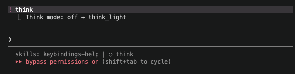
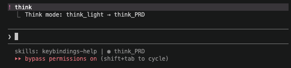
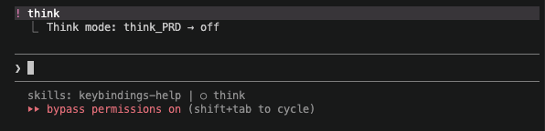

<div align="center">

# 🧠 claude-think

### Reasoning modes + live statusline for Claude Code

Cycle through thinking modes with `!think` — Claude switches model, behaviour, and status bar automatically.

<br/>

</div>

---

## Demo

### `!think` → **think_light** — deep reasoning, no tool use



### `!think` → **think_PRD** — structured discovery interview



### `!think` → **off** — back to normal, model restored



---

## Modes

| | Mode | Model | Behaviour |
|--|------|-------|-----------|
| `○` | **off** | your default | Normal Claude Code |
| `⚡` | **think_light** | Opus (auto) | Reasons and plans only — no code execution, no file writes |
| `◉` | **think_PRD** | Opus (auto) | Runs a structured discovery interview, writes one spec `.md` |

The model switches **automatically** on activation and **restores** when you return to `off`.

---

## Install

**Requirements:** `jq` · `python3` · Claude Code

```bash
git clone https://github.com/deve1993/Claude_Think.git
cd Claude_Think
bash install.sh
```

Restart Claude Code. That's it.

> `install.sh` patches `~/.claude/settings.json` non-destructively — it only adds what's missing.

---

## Usage

In any Claude Code prompt:

```
!think
```

```
off  →  think_light   switches to Opus, enables reasoning-only mode
     →  think_PRD     stays on Opus, starts structured PRD discovery
     →  off           restores your original model
```

The statusline updates after your next message.

---

## How it works

```
~/.config/claude-think/
├── think-toggle.sh   cycles mode + edits settings.json model field
├── think-hook.sh     UserPromptSubmit hook — prepends system context per mode
└── statusline.sh     reads Claude Code JSON from stdin, renders the status bar

~/.claude/state/
└── think-mode.json   { "mode": "off", "previous_model": "sonnet" }
```

**Model switching** — `think-toggle.sh` writes directly to `~/.claude/settings.json`. Claude Code re-reads it per request, so the change is instant with no restart.

**Context injection** — `think-hook.sh` runs before every prompt via the `UserPromptSubmit` hook. When a mode is active it outputs `{"additionalContext": "..."}` which Claude Code prepends silently to your message.

**Statusline** — `statusline.sh` is called by Claude Code on every render. It reads the think-mode state file and appends the mode symbol to the bar.

---

<details>
<summary><strong>Customise</strong></summary>

<br/>

**Change the PRD prompt**
Edit `~/.config/claude-think/think-hook.sh` and replace the `think_PRD` context string with your own flow.

**Change the Opus model**
Edit `~/.config/claude-think/think-toggle.sh` and replace `claude-opus-4-6` with any model ID.

**Add more modes**
The cycle lives in the `case` block in `think-toggle.sh`. Add a state there, its label in `statusline.sh`, and its context in `think-hook.sh`.

</details>

<details>
<summary><strong>Uninstall</strong></summary>

<br/>

```bash
rm -rf ~/.config/claude-think
rm -f /opt/homebrew/bin/think        # or wherever it was installed
rm -f ~/.claude/state/think-mode.json
```

Then edit `~/.claude/settings.json` and remove:
- the `statusLine` key (if added by claude-think)
- the `UserPromptSubmit` entry pointing to `think-hook.sh`

</details>

---

<div align="center">

Built for Claude Code power users who think before they build.

</div>
